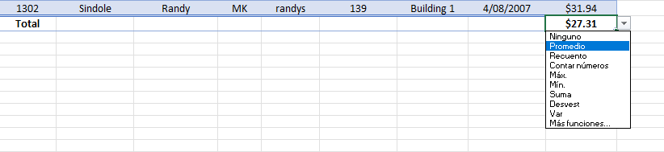

  
---

## Insertar Tablas para Análisis  
### Hoja: Creating Tables  

Antes de comenzar a trabajar con nuestros datos, debemos asegurarnos de que estén correctamente estructurados. Para ello, seguimos los siguientes pasos:  

### 1. Verificación de los Datos  
Antes de convertir el rango en una tabla, verificamos lo siguiente:  

- **Encabezados**: La primera fila debe contener nombres claros y representativos para cada columna.  
- **Valores o Etiquetas**: Los datos deben estar correctamente etiquetados y organizados.  
- **Celdas en Blanco**: No debe haber celdas vacías dentro del conjunto de datos.  

  Para verificar la presencia de celdas en blanco, usamos la función:  
  ```excel
  =CONTAR.BLANCO(rango_datos)
  ```
  Esta fórmula nos indicará cuántas celdas vacías hay en el rango seleccionado.  

### 2. Formateo de los Datos  
Es importante asegurarse de que los datos tengan el formato adecuado:  
- **Números**: Deben estar configurados como tipo de dato "Número".  
- **Fechas**: Deben estar en formato de fecha para evitar problemas en cálculos o filtros.  
- **Texto**: Debe estar correctamente escrito y sin errores tipográficos.  

### 3. Convertir el Rango en Tabla  
Una vez que hemos verificado y formateado los datos, podemos convertir el rango en una tabla usando el atajo de teclado:  
```  
CTRL + T  
```  
Este atajo abre la ventana de creación de tabla, donde confirmamos que los datos tienen encabezados.  

### 4. Opciones Disponibles en una Tabla  
Al convertir el rango en tabla, podemos:  
- **Ordenar** los datos.  
- **Filtrar** la información según criterios específicos.  
- **Ver filas totales** para cálculos automáticos como sumas o promedios.  

### 5. Ordenar Datos en la Tabla  
Para ordenar los datos dentro de la tabla:  
- Usamos el filtro (icono en los encabezados de la tabla).  
- Para ordenar varias columnas al mismo tiempo, seguimos estos pasos:  

  **Paso 1:** Ir a **Inicio > Edición > Ordenar y Filtrar > Orden Personalizado**.  
    

  **Paso 2:** Hacer clic en "Orden personalizado".  
    

  **Paso 3:** Se abrirá una ventana donde podemos agregar niveles para ordenar varias columnas.  
    

Así podemos estructurar mejor nuestros datos y analizarlos con mayor facilidad.


---

Aquí tienes la teoría corregida, ordenada y mejor estructurada:  

---

## Filtrado de Datos en Tablas  
### Hoja: Creating Tables  

Cuando trabajamos con tablas en Excel, podemos aplicar diferentes tipos de filtros para visualizar únicamente la información que necesitamos.  

Uno de los filtros más utilizados es el **filtro de fechas**, el cual nos permite seleccionar rangos específicos, años, meses o días concretos.  

A continuación, realizaremos dos ejercicios prácticos para entender cómo filtrar datos por fecha.  

---

### **Ejercicio 1: Filtrar Contrataciones entre dos Fechas**  
En este ejercicio, vamos a determinar cuántas contrataciones se realizaron entre el **07/02/2001 y el 31/12/2006**.  

**Pasos:**  

1. Hacemos clic en el cuadro de filtro que se encuentra a la derecha del encabezado **"Hire Date"**.  
2. Seleccionamos la opción **Filtros de Fecha**.  
     
3. Aplicamos el filtro indicando las fechas entre **07/02/2001 y 31/12/2006**.  
     
4. Visualizamos el resultado con las contrataciones en ese rango de fechas.  
     

---

### **Ejercicio 2: Filtrar Contrataciones en un Año Específico**  
Ahora, vamos a ver cuántas contrataciones ocurrieron en el año **2010**.  

**Pasos:**  

1. Hacemos clic en el cuadro de filtro de la derecha del encabezado **"Hire Date"**.  
2. En la barra de búsqueda dentro del filtro, escribimos **"2010"** para filtrar solo los datos de ese año.  
     
     
3. Visualizamos el resultado con las contrataciones del año 2010.  
     

---

Con estos métodos, podemos filtrar rápidamente los datos en una tabla, lo que facilita el análisis y la toma de decisiones.

---

Aquí tienes la teoría corregida y organizada de manera clara:  

---

## Usando la Fila de Totales  
### Hoja: Creating Tables  

En Excel, la **Fila de Totales** nos permite realizar cálculos automáticos en una tabla, como **suma, promedio, recuento, mínimo, máximo**, entre otros.  

A continuación, veremos cómo activarla y utilizarla con diferentes funciones.  

---

### **1. Habilitar la Fila de Totales**  
Para activar la **Fila de Totales** en una tabla:  

1. Hacemos clic en la tabla para activar las opciones de diseño.  
2. Vamos a **Diseño de Tabla > Opciones de Estilo de Tabla > Fila de Totales**.  
     

Después de activar esta opción, se agregará una fila al final de la tabla con un cálculo por defecto (generalmente una suma).  
     

---

### **2. Aplicar Funciones en la Fila de Totales**  
Una vez habilitada, podemos cambiar el cálculo aplicado en cada columna.  

1. Hacemos clic en la celda de la Fila de Totales donde queremos aplicar una función.  
2. Abrimos el menú desplegable para seleccionar una opción, como **Promedio, Suma, Recuento, Mínimo o Máximo**.  
     

Por ejemplo, si cambiamos la función de **Suma** a **Promedio**, obtenemos el **promedio de la tasa de pago**.  
     

---

### **Conclusión**  
La Fila de Totales facilita el análisis de datos dentro de una tabla, permitiéndonos obtener cálculos rápidos sin necesidad de escribir fórmulas manualmente.

---